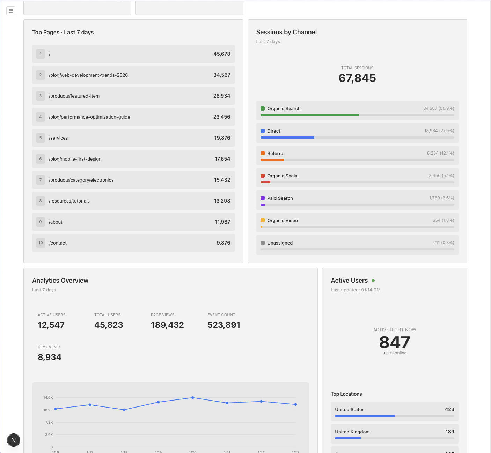
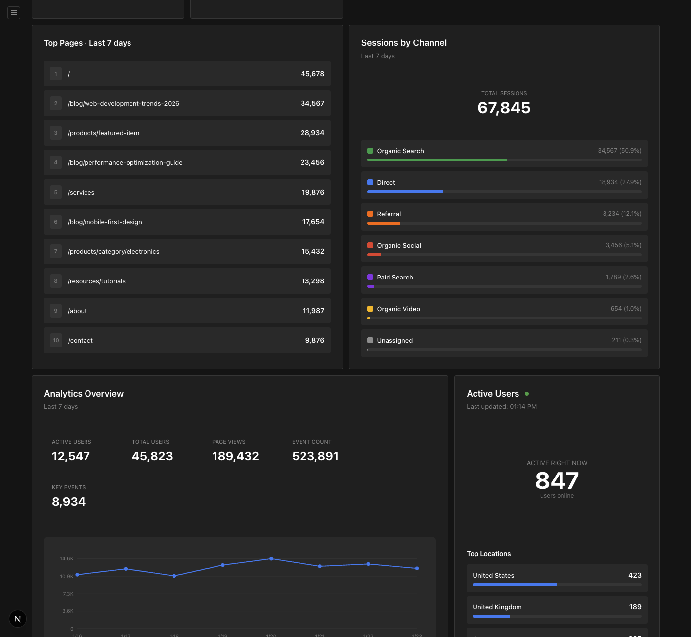

# Google Analytics Dashboard Plugin for Payload CMS

Display Google Analytics 4 (GA4) metrics directly in your Payload Admin dashboard with beautiful, real-time widgets.





## Features

- **Analytics Overview**: Active users, total users, page views, event count, and key events with a 7-day trend chart
- **Top Pages**: Most visited pages with view counts
- **Active Users**: Real-time active users with top 3 locations (updates every 60 seconds)
- **Channel Groups**: Sessions by traffic channel with percentage breakdown
- **Dark Mode Support**: All widgets work seamlessly with Payload's light and dark themes
- **Demo Mode**: Display mock data for screenshots and videos without exposing real analytics

## Installation

### 1. Install the Plugin

```bash
npm install @zubricks/plugin-google-analytics
# or
yarn add @zubricks/plugin-google-analytics
# or
pnpm add @zubricks/plugin-google-analytics
```

### 2. Copy API Routes

The plugin requires three API routes to fetch data from Google Analytics. Copy the API routes to your Next.js app:

```bash
# From your project root (creates api directory if it doesn't exist)
mkdir -p src/app/api
cp -r node_modules/@zubricks/plugin-google-analytics/dist/api/analytics src/app/api/
```

Or manually create symlinks:

```bash
# Create api directory if it doesn't exist
mkdir -p src/app/api/analytics
cd src/app/api/analytics
ln -s ../../../../node_modules/@zubricks/plugin-google-analytics/dist/api/analytics/active-users active-users
ln -s ../../../../node_modules/@zubricks/plugin-google-analytics/dist/api/analytics/pageviews pageviews
ln -s ../../../../node_modules/@zubricks/plugin-google-analytics/dist/api/analytics/channel-groups channel-groups
```

### 3. Google Cloud Setup

#### Enable Google Analytics Data API

1. Go to [Google Cloud Console](https://console.cloud.google.com/)
2. Select or create a project
3. Navigate to "APIs & Services" > "Library"
4. Search for "Google Analytics Data API"
5. Click "Enable"

#### Create Service Account

1. Go to "APIs & Services" > "Credentials"
2. Click "Create Credentials" > "Service Account"
3. Give it a name (e.g., "Payload Analytics Reader")
4. Click "Create and Continue"
5. Grant the role "Viewer" (optional)
6. Click "Done"

#### Download Service Account Key

1. Click on the service account you just created
2. Go to the "Keys" tab
3. Click "Add Key" > "Create new key"
4. Choose "JSON" format
5. Click "Create" (the JSON file will download automatically)

### 2. Google Analytics Setup

#### Add Service Account to GA4

1. Go to [Google Analytics](https://analytics.google.com/)
2. Navigate to "Admin" (gear icon in the bottom left)
3. In the "Account" column, click "Account Access Management"
4. Click the "+" button in the top right
5. Click "Add users"
6. Enter the service account email (found in the JSON file as `client_email`)
7. Select "Viewer" role
8. Uncheck "Notify new users by email"
9. Click "Add"

#### Get Your Property ID

1. In Google Analytics, go to "Admin"
2. In the "Property" column, click "Property Settings"
3. Copy your "Property ID" (it looks like `123456789`)

### 3. Configure Environment Variables

Add the following to your `.env` or `.env.local`:

```bash
# Google Analytics Property ID (from GA4 property settings)
GA_PROPERTY_ID=123456789

# Base64 encoded Google Service Account credentials
# To encode the JSON file, run this command in your terminal:
# cat path/to/your-service-account-key.json | base64
GA_CREDENTIALS=<base64-encoded-json>

# Optional: Enable demo mode (default: false)
GA_USE_DEMO_DATA=false
```

#### Encoding the Service Account JSON

Run this command to base64 encode your service account JSON file:

```bash
cat path/to/your-service-account-key.json | base64
```

Copy the output and paste it as the value for `GA_CREDENTIALS`.

**macOS/Linux shortcut** to copy directly to clipboard:

```bash
cat path/to/your-service-account-key.json | base64 | pbcopy
```

### 5. Add Plugin to Payload Config

```typescript
import { googleAnalytics } from '@zubricks/plugin-google-analytics'

export default buildConfig({
  // ... other config
  plugins: [
    googleAnalytics({
      // Optional: Configure which widgets to enable
      enabledWidgets: ['analytics-overview', 'top-pages', 'active-users', 'channel-groups'],

      // Optional: Define default dashboard layout
      defaultLayout: [
        {
          widgetSlug: 'analytics-overview',
          width: 'medium',
        },
        {
          widgetSlug: 'top-pages',
          width: 'full',
        },
        {
          widgetSlug: 'active-users',
          width: 'x-small',
        },
        {
          widgetSlug: 'channel-groups',
          width: 'x-small',
        },
      ],

      // Optional: Override environment variables
      // propertyId: '123456789',
      // credentials: 'base64-encoded-json',
      // useDemoData: false,
    }),
  ],
})
```

## Configuration Options

### Plugin Config

| Option | Type | Default | Description |
|--------|------|---------|-------------|
| `propertyId` | `string` | `process.env.GA_PROPERTY_ID` | Google Analytics GA4 Property ID |
| `credentials` | `string` | `process.env.GA_CREDENTIALS` | Base64 encoded service account JSON |
| `useDemoData` | `boolean` | `process.env.GA_USE_DEMO_DATA === 'true'` | Enable demo mode to display mock data |
| `enabledWidgets` | `array` | All widgets | Array of widget slugs to enable |
| `defaultLayout` | `array` | `undefined` | Default dashboard layout configuration |

### Available Widgets

- `analytics-overview` - Metrics overview with trend chart (minWidth: `medium`)
- `top-pages` - Top 10 most visited pages (minWidth: `medium`)
- `active-users` - Real-time active users by location (minWidth: `x-small`)
- `channel-groups` - Sessions by traffic channel (minWidth: `x-small`)

### Widget Width Options

- `x-small`: 25% width
- `small`: 33.3% width
- `medium`: 50% width
- `large`: 66.7% width
- `x-large`: 75% width
- `full`: 100% width

## Demo Mode

Perfect for creating screenshots, videos, or development without exposing real analytics data.

Enable demo mode in your environment variables:

```bash
GA_USE_DEMO_DATA=true
```

Or in the plugin configuration:

```typescript
googleAnalytics({
  useDemoData: true,
})
```

When enabled, all widgets display realistic mock data without connecting to Google Analytics.

## API Endpoints

The plugin provides three API endpoints:

- `GET /api/analytics/pageviews` - Analytics overview and top pages data
- `GET /api/analytics/active-users` - Real-time active users
- `GET /api/analytics/channel-groups` - Sessions by channel

All endpoints automatically respect the `GA_USE_DEMO_DATA` environment variable.

## Troubleshooting

### "Google Analytics not configured" error

Make sure both `GA_PROPERTY_ID` and `GA_CREDENTIALS` environment variables are set correctly.

### "Failed to get access token" error

1. Verify your service account JSON is properly base64 encoded
2. Check that the service account has been added to your Google Analytics property
3. Ensure the Google Analytics Data API is enabled in your Google Cloud project

### "GA4 API request failed" error

1. Verify your `GA_PROPERTY_ID` is correct
2. Check that the service account has "Viewer" access to the property
3. Make sure you're using a GA4 property (not Universal Analytics)

### Data not showing

1. Ensure your website has the GA4 tracking code installed
2. Verify there's actual traffic data in your GA4 property
3. Check the browser console for any error messages
4. Make sure you've restarted your development server after adding environment variables

### Widgets not appearing

1. Check that the plugin is added to the `plugins` array in your Payload config
2. Verify the `ComponentPath` can resolve correctly
3. Check browser console for any import errors

## Development

### Running Locally

The plugin automatically uses environment variables by default, making it easy to develop locally:

1. Set up your `.env.local` with GA credentials
2. Add the plugin to your Payload config
3. Run your development server
4. Widgets will appear in the dashboard

### Testing with Demo Data

For development without real GA data:

```bash
GA_USE_DEMO_DATA=true pnpm dev
```

## Publishing to NPM

When ready to publish as a standalone package:

1. Move the plugin to its own repository
2. Update `package.json` with proper exports
3. Add TypeScript types
4. Publish to npm

Example `package.json`:

```json
{
  "name": "@your-org/payload-plugin-google-analytics",
  "version": "1.0.0",
  "type": "module",
  "exports": {
    ".": {
      "types": "./dist/index.d.ts",
      "default": "./dist/index.js"
    }
  }
}
```

## License

MIT

## Credits

Built with [Payload CMS](https://payloadcms.com/)
